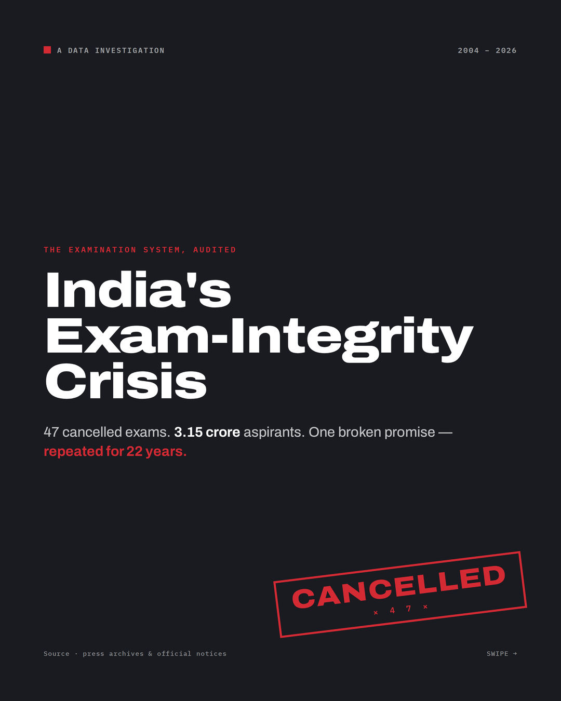
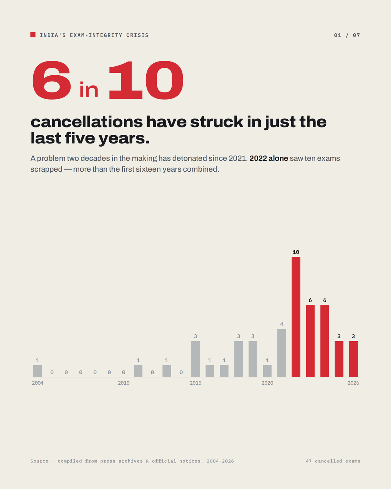
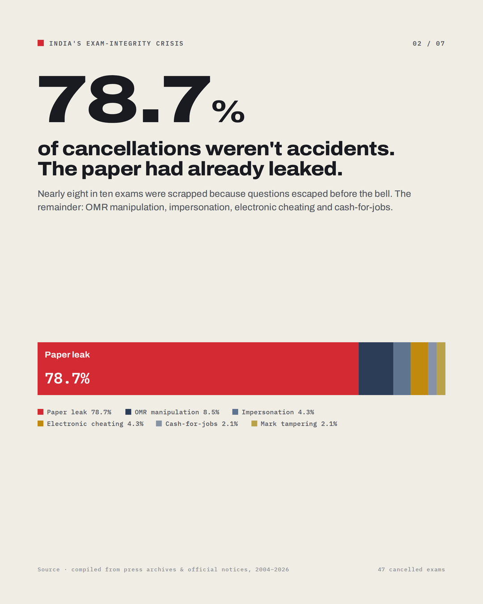
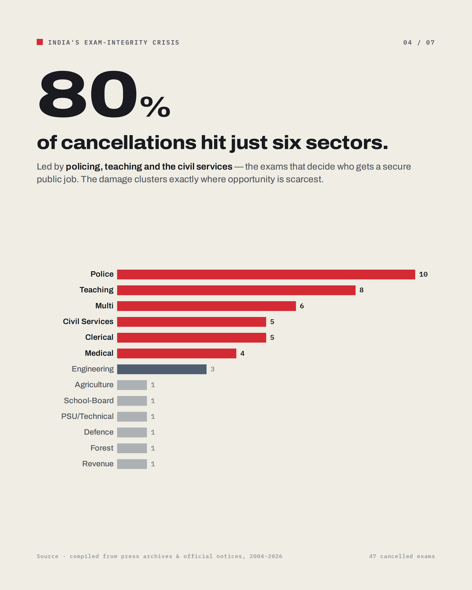
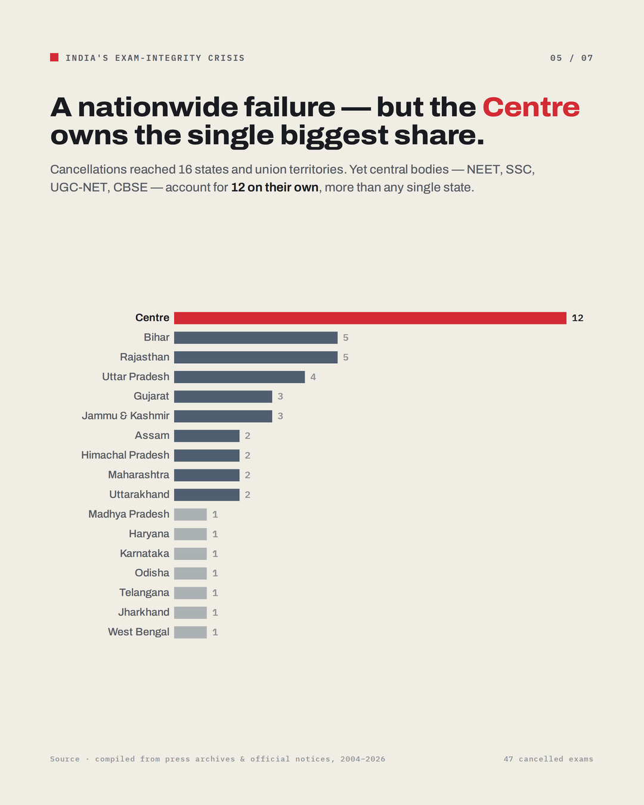

# India's Exam-Integrity Crisis — A Data-Driven Analysis (2004–2026)

A data investigation into **47 major Indian exam cancellations** between 2004 and 2026 — what
caused them, who paid, and how the pattern has changed over 22 years.

This repository contains the dataset, a fully reproducible analysis notebook, and the polished
LinkedIn carousel built from the findings.



---

## TL;DR — the findings

- **6 in 10** cancellations struck in just the **last five years** (2022–2026). 2022 alone saw **10**.
- **78.7%** were caused by **paper leaks** — not cheating in the hall, but questions escaping beforehand.
- Of **~3.15 crore (31.5M)** aspirants impacted, **60%** were sitting **recruitment** exams for government jobs.
- **80%** of cancellations hit **six sectors**, led by **police, teaching and the civil services**.
- Failures were **nationwide**, but **central bodies** (NEET, SSC, UGC-NET, CBSE) form the single largest bucket (**12**).
- **66%** occurred under **NDA-led** governments — a figure that partly reflects years in power (see *Limitations*).

> Every number above is reproduced, with code, in [`analysis.ipynb`](analysis.ipynb).

---

## The carousel

<p>
  
  
  
  
</p>

Full deck: [`carousel/exam_integrity_crisis.pdf`](carousel/exam_integrity_crisis.pdf) · individual
frames in [`carousel/`](carousel/) (1080×1350, LinkedIn 4:5).

---

## Repository structure

```
.
├── README.md
├── requirements.txt
├── analysis.ipynb                        # reproducible analysis + charts
├── data/
│   └── india_exam_cancellations_2004_2026.csv
└── carousel/
    ├── exam_integrity_crisis.pdf         # 7-slide LinkedIn carousel
    └── slide_1.png … slide_7.png         # individual frames
```

---

## Data

`data/india_exam_cancellations_2004_2026.csv` — one row per cancellation incident (47 rows, 26 columns).
Each row is a **publicly reported** incident, with a per-row `source` and a `data_confidence` flag.

**Key fields**

| Column | Meaning |
|---|---|
| `cancellation_year` | Year the exam was cancelled / annulled |
| `exam_name`, `conducting_body`, `level` | What was cancelled and who ran it |
| `state_ut` | Jurisdiction — `Centre` = central bodies (NEET, SSC, UGC-NET, CBSE …) |
| `exam_purpose` | Recruitment / Admission / Eligibility / Board |
| `sector` | Domain of the exam (Police, Teaching, Medical …) |
| `cause` | Paper leak, OMR manipulation, impersonation … |
| `aspirants_impacted` | Estimated candidates affected |
| `coalition_then` | Ruling national coalition at the time |
| `data_confidence`, `source` | Confidence flag and citation |

## How this dataset was built

The 47 incidents were compiled from primary and reported sources — Supreme
Court and High Court judgments, CBI/ED/SIT filings and official commission
notifications, corroborated against national and regional press (The Hindu,
Indian Express, Times of India, PTI, Deccan Herald, The Tribune, Newslaundry
and others) — covering **January 2004 to June 2026**.

An incident **qualifies** if a government exam for admission or recruitment was
actually *held or scheduled* and then **cancelled, annulled, or forced into a
re-test** because of a paper leak, court order, or malpractice (OMR tampering,
impersonation, cash-for-jobs).

**Eliminated** were:

- leaks where an FIR was filed but the exam still stood (no cancellation);
- routine postponements unrelated to integrity;
- cases whose cancellation could not be independently confirmed.

Because there is no central registry of cancelled exams, this is a curated
record of *documented* cases, not an exhaustive census — coverage is thinnest
for pre-2015 years and smaller states, and a few candidate-impact figures
(flagged in the data) are contested.

---

## Reproduce the analysis

```bash
git clone https://github.com/<your-username>/<repo>.git
cd <repo>
python -m venv .venv && source .venv/bin/activate
pip install -r requirements.txt
jupyter lab analysis.ipynb    # or: jupyter notebook analysis.ipynb
```

Run the notebook top to bottom. Its only input is the CSV in `data/`.

---

## Limitations & honest caveats

The headline story holds — cancellations are **frequent, recent, leak-driven, and concentrated on
government-job aspirants**. But each individual number has a boundary:

1. **Reporting bias in early years.** Sparse pre-2015 counts likely reflect thinner coverage, not a
   cleaner system. The upward trend is *partly* real worsening, *partly* better documentation.
2. **`Centre` is not a state.** It pools national bodies and out-tops every state by construction.
   The geography chart answers *"which jurisdiction,"* not *"which state is worst."*
3. **Coalition share ≈ time in power.** The 66% figure is an association, not a verdict; attribution
   would require normalising by years in office and exams conducted.
4. **"80% / six sectors."** The three named leaders are ~49%; it takes six sectors to reach 80%.
5. **Two valid "last 5 years."** 2022–2026 ≈ 60%; 2021–2026 ≈ 68%. The carousel uses 60%.
6. **Counts vs severity.** An incident count treats a national leak the same as one district
   reschedule; `aspirants_impacted` is the better severity lens.

---

## License & attribution

- `MIT`
- Per-incident sources are in the dataset's `source` column. If you reuse this, please cite the
  original reporting, not just this compilation.

_Built with pandas, matplotlib and seaborn. Carousel typeset in Archivo + IBM Plex Mono._
